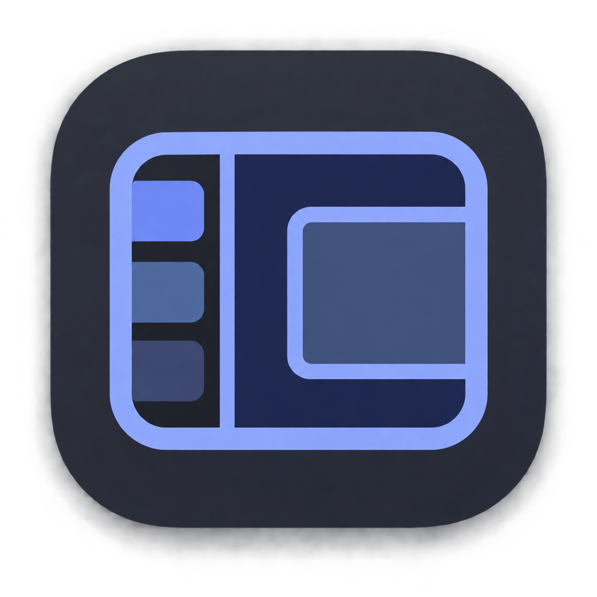

# TabDesk



macOS で他アプリのウィンドウを「タブ」として管理するユーティリティ(開発中)。
リポジトリ: https://github.com/Akkanbe/TabDesk
仕様は [docs/01_spec.md](docs/01_spec.md) を参照。

## 現在の状態: v4 実装済み(実機確認中)

フル Xcode は不要(Command Line Tools の Swift で足ります)。

```bash
./scripts/build_app.sh      # swift build → build/TabDesk.app を組み立て
                            # 署名: CODESIGN_IDENTITY > 「WTC Dev」証明書があれば自動使用 > ad-hoc
open build/TabDesk.app
```

TabDesk はメニューバー常駐アプリ(Dock には出ない)。起動すると**各ディスプレイ**の左端にサイドバーが出る
(v4: タブはディスプレイごとに独立。タブ切替はその画面の窓だけに作用する)。
初回起動時にシステムの権限ダイアログが自動で出るので、システム設定 > プライバシーとセキュリティ >
アクセシビリティ で TabDesk を ON にする(ダイアログを閉じてしまった場合はサイドバー上部の「権限をリクエスト」で再表示できる)。

**注意(ad-hoc 署名の制約)**: 「WTC Dev」証明書が無い環境では ad-hoc 署名になります(ビルド末尾に `signed with: -` と出ます)。
この場合、再ビルドすると署名ハッシュが変わり、設定上は ON のままでも権限が効かなくなります(ログ先頭の `trusted=false` で分かります)。OFF → ON では直らないので、アクセシビリティの一覧で TabDesk を
「−」で削除してから「+」で `build/TabDesk.app` を追加し直してください。

#### 再ビルドごとの再付与を避ける(推奨): 自己署名証明書で署名する

TCC はアプリを「署名の識別情報」で覚えます。ad-hoc 署名はビルドごとに識別情報が変わりますが、
自己署名でも証明書で署名すれば識別情報が安定し、再ビルド後も権限が維持されます。

1. キーチェーンアクセス.app を開く → メニュー「キーチェーンアクセス」>「証明書アシスタント」>「証明書を作成...」
2. 名前: `WTC Dev`(任意の名前でよい。別名にした場合は `CODESIGN_IDENTITY` で指定)/
   固有名のタイプ: 自己署名ルート / 証明書のタイプ: **コード署名** → 「作成」
3. 作成した証明書をダブルクリック → 「信頼」>「コード署名」を「常に信頼」にする
4. 以後は識別名を指定してビルドする(`WTC Dev` なら自動検出されるので指定不要):

```bash
CODESIGN_IDENTITY="WTC Dev" ./scripts/build_app.sh
```

証明書を切り替えた直後の 1 回だけは、上記の「−」→「+」で再登録が必要です。

## ウィンドウが見つからないとき

メニューバーの「ウィンドウの復旧手順…」から案内を開けます。

1. Mac のロックを解除し、TabDesk が終了していれば起動します。
2. サイドバーを展開し、対象ウィンドウを登録したタブを選びます。
3. 未復元のままなら、相手アプリの最小化・フルスクリーンを解除し、「未復元のウィンドウを再検索」を選びます。判別できない場合は未復元の登録行をクリックし、正しい窓を選びます。
4. 管理を外すには、窓が戻ったことを確認して登録行の「×」を押します。書類そのものは閉じません。

切断したモニターのタブは、元のモニターを再接続して確認してください。アクセシビリティ権限不足の場合はシステム設定で TabDesk を許可します。再検索後も、非選択タブの窓はそのタブを選ぶまで表示されません。

強制終了やロック中の終了では窓が退避先に残る場合があります。復旧前に設定ファイルを削除しないでください。改善しなければ発生時刻とログを確認します。ログには窓のタイトルが含まれるため、共有前に内容を確認してください。原因別の整理と検証範囲は [復旧確認記録](docs/16_window_recovery.md) にあります。

Use **Window Recovery Help…** in the menu bar for recovery instructions. Unlock your Mac, relaunch TabDesk if needed, and select the window's tab. For unrestored registrations, leave minimization/full screen and choose **Find Unrestored Windows Again**. Click an unrestored row to assign the correct window manually if matching remains ambiguous. Use the row's **×** to unregister a recovered window without closing its document. Reconnect disconnected displays, and keep your settings files until recovery is complete.

## テスト

```bash
./scripts/test.sh        # Core とアプリ層のテスト(Accessibility 権限不要)
```

エンジンは `WindowDriver` プロトコル越しにしかウィンドウを触らないので、テストでは偽のドライバを
差し込んで切替・復元・整合性維持のロジックを検証している。設計は [docs/03_core_design.md](docs/03_core_design.md)。
AppKit の初期化・描画が Core の応答時間テストへ干渉しないよう、アプリ層のテストは別プロセスで実行する。


### サイドバーの使い方

- 「＋」でタブを作成(そのサイドバーの画面のタブになる)。タブはクリックで切替、ダブルクリックで改名、
  右クリックで並べ替え(同じ画面内の上へ/下へ)・改名・削除
- v4 への移行: 複数画面の窓が混在していたタブは、初回起動時に窓の画面ごとへ自動分割される
  (名前は維持、分かれた側は「名前 (2)」。移行前のファイルは state.v3.bak.json に退避される)
- ホットキーは「選択中のディスプレイ」に作用する。画面切替キーで選んだ画面を優先し、
  通常はフォーカス中の窓の画面 → マウスカーソルの画面の順に判定する。
  編集モードで窓を別の画面へドラッグすると、その画面のアクティブタブへ移る(自由配置のタブのみ。
  タイル配置の窓は固定位置へ戻る)。ディスプレイを抜くと、その画面のタブは保存されたまま凍結し、
  差し直すとタブも配置も復活する
- 「＋ ウィンドウを追加」で開いているウィンドウを、そのサイドバーのアクティブタブに登録。
  別画面の窓を選んだ場合はタブが属する画面へ移動する。Ctrl+Option+R ではフォーカス窓の画面の
  アクティブタブへ登録する。退避は原則その画面の右下隅だが、そこから別画面へ窓が露出する配置では
  配置全体の安全な右端へ退避する(退避先に 1px の線が残る)。
  ネイティブフルスクリーン中・最小化中のウィンドウは登録候補に出ない(登録済みの窓を後から最小化した場合は登録のまま)
- ウィンドウ行の「×」で登録解除(退避中なら元の位置に戻してから解除)
- タブの右クリックで「レイアウト: タイル / 自由配置」を選べる。新しいタブは手動タイル方式で始まる。
  分割・結合・境界の調整は「タイルを編集…」で行い、登録を解除しても空タイルは残る。
  既存の「縦に等分割」は従来の自動カラム配置を維持する。こちらは登録窓の並び順と数で列を組み直す。
  相手アプリの最小サイズなどで要求寸法にできない場合は、到達した実サイズを保持する。
- 「編集モード」ON の間は、動かした位置・サイズがそのまま固定位置として記憶される。
  OFF のときは、動かしても離して約 0.25 秒後に固定位置へ戻る。
  タイル・旧カラム配置では編集モードでも記録されず、固定位置へ戻る
- サイドバーをクリックしても作業中のアプリのフォーカスは奪わない
- サイドバー右端の細いハンドルをドラッグすると幅を変えられる(160〜400px。離した時点で保存され、
  窓の配置範囲も追従)。左端がサイドバー境界に接している自由配置の窓は右端を保ったまま伸縮し、
  中ほどに置いた窓は必要な場合だけ配置範囲内へ寄せられる
- ヘッダの「«」(または **Ctrl+Option+S**、メニューバーの「サイドバーを折りたたむ」)でサイドバーを
  細いバーに畳める。畳んだ分だけ窓の配置範囲が広がる。細いバーのクリックで元に戻る。
  タイル・旧カラム配置も新しい配置範囲へ追従する

### ホットキーとフォーカス連動

- **Control + Option + → / ←** で次／前のディスプレイへ切り替える。
  画面は配置の左から右、同じ横位置なら上から下の順に循環する。1画面では何もしない。
  移動先の選択中タブで最後に使った操作可能な窓へフォーカスを戻す。
  続けて **Control + Tab / Control + Shift + Tab** または **Control + Option + 1〜9** を押すと、
  移動先のタブを切り替えられる。マウスポインタは移動しない。
  空タブでも操作対象を維持する。サイドバーの枠線が対象画面を示し、入力先へフォーカスできない場合は
  オレンジ色になる（枠内のツールチップに案内を表示）。折りたたみ中も枠線を表示する。
  クリックや Cmd+Tab で別画面の窓へフォーカスを移すと操作対象も追従する。
  画面切替のキーもホットキー設定で変更・解除できる。


- 既定のホットキー: **Ctrl+Option+1〜9** でタブ切替、**Ctrl+Tab / Ctrl+Shift+Tab** でタブの順送り/逆送り、
  **Ctrl+Option+R** でフォーカス中の窓をアクティブタブに登録、**Ctrl+Option+E** で編集モード切替、
  **Ctrl+Option+S** でサイドバーの折りたたみ切替。
  注意: グローバルホットキーなので、TabDesk 起動中は Ctrl+Tab が他アプリ(ブラウザのタブ切替等)に届かなくなる。
  メニューバーの「ホットキー設定を開く」で設定欄をクリックし、使いたいキーの組み合わせを実際に押す。
  16項目を編集でき、画面には `⌃⌥1` のように表示する。記録中はTabDeskのホットキーを一時解除する。
  Escでキャンセル、各行の「×」または記録中のDeleteで割り当てを解除し、「保存して適用」で反映する。
  Control / Option / Shift / Command のいずれかとキーを組み合わせる。修飾キー付きのTabやEscも記録できる。
  別アプリへ移動した場合や設定画面を閉じた場合も記録を終了し、元のホットキーを復帰させる。
  macOSや他アプリが先に処理するキーは記録できない場合がある。
  形式や重複のエラーがある場合は保存せず、他アプリとの競合など登録時のエラーは保存後に画面へ表示する。
  「既定値を入力」はフォームだけを戻し、「保存して適用」までファイルは変わらない。
  従来どおり `~/Library/Application Support/TabDesk/hotkeys.json` の手編集と「ホットキーを再読み込み」も使える。
  「ホットキー設定ファイルをFinderで表示」はファイルの場所を表示する。JSON の既定アプリは起動しない。
  JSON では個別操作を `"nextTab": null` のように無効化し、`activateTab` の空文字はそのタブ番号だけを無効化する。
- **フォーカスで自動切替**(既定 ON): Cmd-Tab などで非アクティブタブの窓にフォーカスが移ると、そのタブへ自動で切り替わる。
  メニューバーで OFF にできる
- メニューバーに「ログイン時に起動」トグルあり
- メニューバーの「背景の枠を表示」を ON にすると、窓の配置範囲(コンテンツ領域)の背後に
  うっすらした枠が敷かれ、タブが「容れ物」のように見える(既定 OFF。クリックは素通し)
- メニューバーの「タブサムネイルを表示」を ON にすると、タブを切り替えるたびに離れたタブの
  代表ウィンドウが撮影され、タブ行の下にサムネイルとして表示される(既定 OFF)。
  初回 ON 時に**画面収録**の権限を求められる(付与後は再起動が必要な場合あり。
  macOS の仕様で月次の再承認ダイアログも出る)

タブ構成は `~/Library/Application Support/TabDesk/state.json` に自動保存され、次回起動時に復元される。
再起動後は bundle ID・タイトル・サイズで同じウィンドウを推定して紐付け直す。推定できなかったものは
一覧に「(未復元)」とグレー表示され、クリックするといま開いているウィンドウを手で割り当てられる。
登録したアプリを終了した場合も「未復元」として残り、アプリを起動し直すと自動で戻る(窓だけ閉じた場合は登録から外れる)。

ログ: `~/Library/Logs/TabDesk/tabdesk.log`(メニューバーの「ログを開く」)

保存に失敗するとメニューバーのアイコンが警告に変わる。メニューの「タブ構成の保存に失敗…」から
原因・保存先を確認し、「再試行」で保存をやり直せる。保存に成功すると警告は消える。
破損ファイルのバックアップにも失敗した場合は「自動保存を停止中」と表示し、原本保護のため再試行は提供しない。
その場合は保存先とアクセス権を確認し、元ファイルを保護してから再起動する。

本体・PoC ともログは5 MiBを超える追記の前にローテーションし、`.log.1`(最新)〜`.log.3`を保持する。
1件で上限を超えるメッセージは末尾に `[log entry truncated]` を付けて省略する。
導入前から上限を超えているログは、最初の追記時に内容を維持したまま `.log.1` へ退避する。
書き込み・世代更新に失敗した場合は標準出力へエラーを出し、次のログで再試行する。

### URL スキームによる操作(動作確認・自動化用)

**既定では無効**です。`tabdesk://` は Accessibility 権限を持つ TabDesk への代理操作口になるため、
使うときだけメニューバーの「URL コマンドを許可(自動化用)」を ON にしてください(設定は再起動後も維持されます)。
無効のまま送ったコマンドはログに `URL commands are disabled` と出て無視されます。

```bash
open -g 'tabdesk://status'
open -g 'tabdesk://windows'                # 登録可能なウィンドウ一覧をログに出す
open -g 'tabdesk://tab?name=Work'          # 選択中の画面に作成
open -g 'tabdesk://tab?display=1'          # 画面 index を指定(名前は画面ごとの連番)
open -g 'tabdesk://add?wid=123&tab=Work'   # tab 省略時は選択中の画面のアクティブタブ
open -g 'tabdesk://activate?name=Work'
open -g 'tabdesk://remove?wid=123'
open -g 'tabdesk://edit?on=1'
open -g 'tabdesk://restore'               # 未復元エントリの紐付けをやり直す(strict=1 で厳しめ)
open -g 'tabdesk://save'                  # 今すぐ保存
open -g 'tabdesk://dump'                  # 座標の突き合わせ(診断)
open -g 'tabdesk://quit'
```

## タイルモード

新しいタブはタイルモードで作成されます。タブを右クリックすると自由配置へ切り替えられます。既存のタブの配置は維持します。

タブの右クリックから「タイル構成を複製」を選ぶと、同じ画面の元タブの直後にコピーを作ります。
適用済みの分割・比率を引き継ぎ、すべて空タイルで開始します。窓は必要なものを新しく登録してください。
元タブの窓や選択中のタブは変わらず、コピー側の編集も元タブへ影響しません。編集中の未適用の変更を
複製したい場合は、先に「適用」を押してください。自由配置・旧カラム配置ではこの操作は無効です。

Choose **Duplicate Tile Layout** from a tile tab's context menu to create an independent copy next to it on the same display.
The copy contains the applied tile geometry and starts with empty tiles. Registered windows and unsaved edits are not copied.

1. 「タイルを編集…」を開き、タイルを左右・上下に分割します。境界をドラッグして比率を調整し、「適用」を押します。
2. 空タイルを選び、「このタイルにウィンドウを追加…」で窓を登録します。登録済みの窓はプルダウンで割り当てを変更できます。
3. サイドバーを広げたり折りたたむと、全タイルが利用可能な領域に追従します。窓の登録を解除しても空タイルは残ります。

「元に戻す」（⌘Z）・「やり直す」（⇧⌘Z）は、分割・結合・窓の割り当て・境界ドラッグに対応します。
1 回のドラッグは 1 操作として戻せます。直近 100 操作を保持し、新しい編集を行うとやり直し履歴を消します。
「適用」で配置が保存されたとき、「読み直す」を押したとき、編集画面を開き直したときに履歴を初期化します。
言語切替や通常の状態通知では履歴を維持します。操作の取り消し・やり直しも「適用」までは実窓を動かしません。

配置できない窓がある場合、サイドバーに件数を表示します。「タイルを編集…」では、対象のアプリ名・
ウィンドウ名・現在の編集内容でのタイル番号を一覧から選べます。「対象タイルを選択」で移動し、
タイルを広げるか割り当てを変更して「適用」してください。配置の成功を確認できた窓は一覧から消えます。
失敗原因を特定できていない場合、最小サイズ制限などと断定する表示はしません。

In the tile editor, **Undo (⌘Z)** and **Redo (⇧⌘Z)** affect the draft only. Each divider drag counts as one step.
Up to 100 steps are kept until the layout is applied, reloaded, or the editor is reopened.
If placement fails, choose the affected window from the list and click **Select Tile**, adjust the tile or its assignment, and click **Apply**.

同じ分割から生まれた隣接タイルは、少なくとも片方が空なら結合できます。他アプリの最小サイズなどでタイルへ配置できない場合は警告を表示します。[操作・保存形式・制約](docs/12_tile_mode.md)も参照してください。

## 表示言語 / Display Language

メニューバーの「表示言語 / Language」で「日本語」「English」を選べます。変更はすぐに反映され、次回起動時にも保持されます。既存のタブ名と、編集中のホットキー設定はそのままです。

Choose **表示言語 / Language → English** from the TabDesk menu. The change takes effect immediately and is remembered across launches. Existing tab names and unsaved shortcut edits are preserved.

## v0 技術検証 PoC(TabDeskPoC)

`TabDeskPoC` は仕様書 §5 の v0 チェックリストを実機で確認した検証アプリ(結果は docs/02_poc_results.md)。
ベンチ計測の再実行用に残している。

```bash
PRODUCT=TabDeskPoC ./scripts/build_app.sh
open build/TabDeskPoC.app
```

署名と TCC の注意は上記 TabDesk と同じ(名前は TabDeskPoC / `build/TabDeskPoC.app` に読み替え)。
PoC を証明書で署名し直す場合は `PRODUCT=TabDeskPoC CODESIGN_IDENTITY="WTC Dev" ./scripts/build_app.sh`。

### PoC 画面の使い方

1. 「ウィンドウ一覧を更新」で他アプリの標準ウィンドウを列挙(WID = CGWindowID)
2. 行を選んで「セット A に追加」「セット B に追加」(A/B がタブに相当)
3. 「左半分」「右半分」「全面」で、サイドバー幅 240px を除いたコンテンツ領域に配置
4. 「A を表示」「B を表示」で切替(非表示側は画面右下隅へ退避、1px だけ残る)
5. 「往復ベンチ ×10」で切替時間を計測。「pid 並列」の ON/OFF で比較
6. 「スナップバック監視」ON にして、表示中のウィンドウを手でドラッグ → 元の位置に戻るか確認
7. 「編集モード」ON の間は、動かした位置が新しい固定位置として記憶される

ログは画面下部と `~/Library/Logs/TabDeskPoC/poc.log` に出ます。

### PoC の URL スキーム

起動中の PoC に `tabdeskpoc://` で同じ操作を送れます。

```bash
scripts/poc.sh status
scripts/poc.sh list                         # ウィンドウ一覧をログに出す
scripts/poc.sh 'add?set=A&wid=123,456'
scripts/poc.sh 'place?wid=123&where=left'   # left | right | full
scripts/poc.sh 'show?set=B'
scripts/poc.sh 'bench?rounds=10&parallel=1'
scripts/poc.sh 'watch?on=1&mode=debounced&ms=250'   # スナップバック監視(mode=immediate で即時)
scripts/poc.sh 'edit?on=1'                  # 編集モード
scripts/poc.sh 'move?wid=123&x=100&y=50&w=800&h=600'  # 任意 frame へ移動(AX 座標)
scripts/poc.sh log                          # ログ末尾を表示
```

## 構成

```text
Sources/AXShim/    私有関数 _AXUIElementGetWindow を dlsym で解決する C シム(私有 API 依存はここだけ)
Sources/TabDesk/       本体アプリ: サイドバー(NSPanel)・メニューバー・AX 通知とエンジンの配線
Sources/TabDeskCore/   コアモジュール: データモデル・TabEngine(切替/復元/整合性)・AX ラッパー
Tests/TabDeskCoreTests/ エンジンのユニットテスト(偽ドライバ使用)
Sources/TabDeskPoC/    v0 検証アプリ
Resources/<Product>/   各アプリの Info.plist(TabDesk / TabDeskPoC)
scripts/           ビルド・操作スクリプト
docs/              仕様書
```
